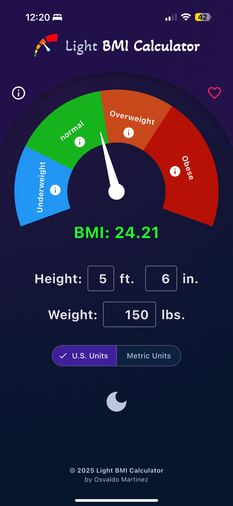
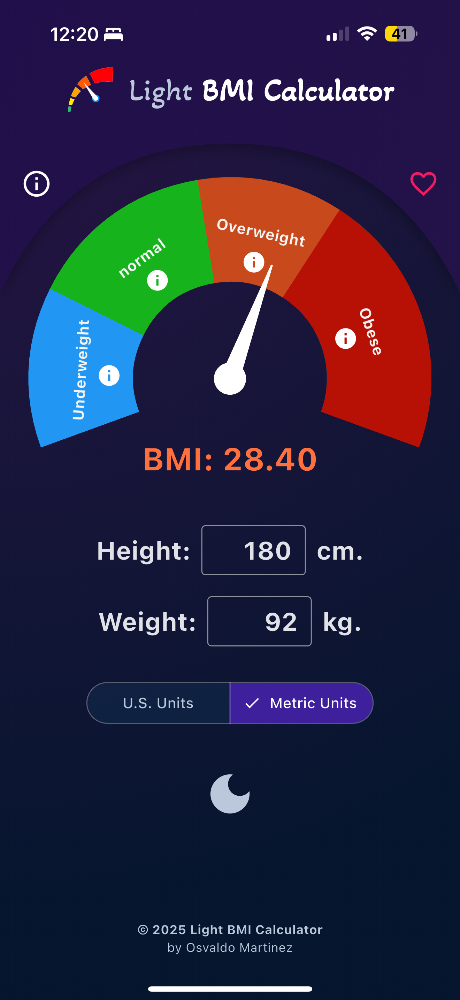
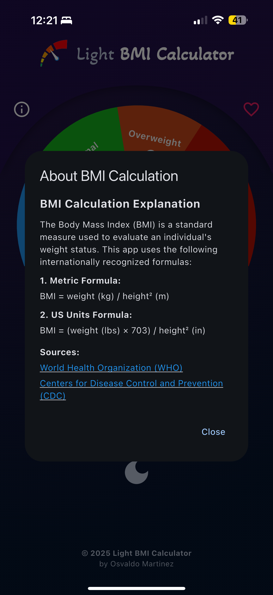
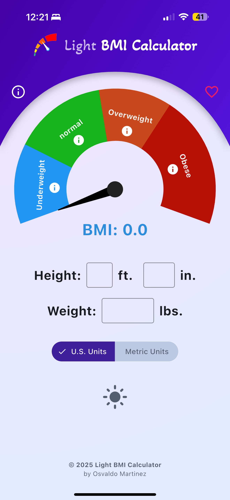
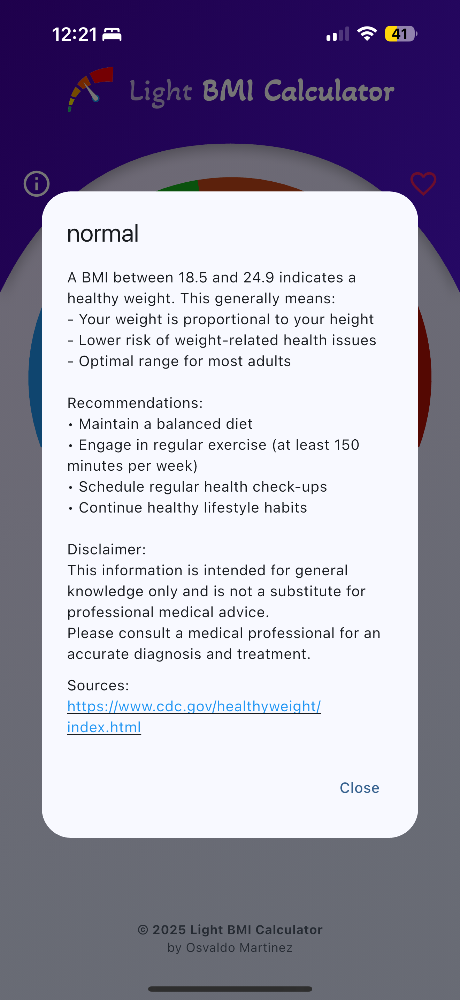

# Light BMI Calculator

A simple and user-friendly Body Mass Index (BMI) calculator mobile application built with Flutter.

## Description

Light BMI Calculator is an easy-to-use application that helps users calculate and track their Body Mass Index. The app provides a clean interface where users can input their height and weight to get instant BMI results.

## Features

- Quick and accurate BMI calculations
- Simple and intuitive user interface
- Height input in meters/centimeters
- Weight input in kilograms
- Instant results with BMI classification
- Clean and modern design

## What's New (v1.1.0)

- **Enhanced UI:** Added icons for height and weight labels and improved the overall interface.
- **US Units Support:** New interface style specifically designed for US unit inputs.
- **Native Splash Screen:** Added a native splash screen with support for both Light and Dark modes.
- **In-App Review:** Integrated smart logic to request reviews after the app has been used multiple times.
- **Project Structure:** Major updates to dependencies and internal project organization for better performance and maintainability.

## App Availability

1. iOS (App Store):  
   https://apps.apple.com/us/app/light-bmi-calculator/id6740174361
2. Not yet on Play Store due to laziness, but coming soon.

## For Developers

1. Clone this repo:
   ```
   git clone git@github.com:MystiC1988/Light_BMI_Calculator.git
   cd Light_BMI_Calculator
   flutter pub get
   ```
2. Create a `.env` file in the project root:
   ```
   IOS_REVENUECAT_API_KEY=ios_api_key
   ANDROID_REVENUECAT_API_KEY=android_api_key
   ```
3. Run locally:
   ```
   flutter run
   ```

## Requirements

- Flutter SDK (latest)
- iOS 12.0+ / Android 6.0+

## Screenshots

<p float="left">
   
   
   
   
   
</p>

## Contributing

Open a pull request or file an issue on GitHub.

## License

MIT License. See LICENSE file for details.
